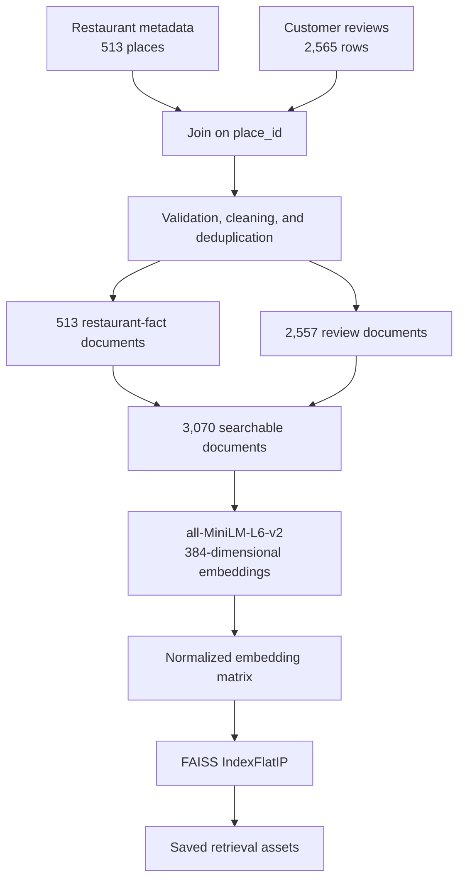
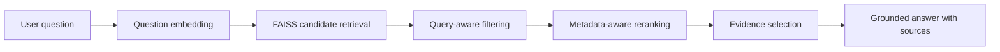

System Architecture

Padova Restaurant RAG transforms structured restaurant metadata and customer
reviews into a semantic knowledge base for question answering.

## Current Pipeline

The current implementation produces two complementary document types:

- **Restaurant-fact documents** contain structured properties such as cuisine,
  rating, delivery, dine-in availability, reservations, and opening hours.
- **Review documents** contain customer evidence about food, service, value,
  ambiance, and the overall dining experience.

Using both types prevents review text from being used as an unreliable source
for factual properties while preserving semantic evidence for subjective
questions.

## Saved Retrieval Assets

The build pipeline creates:

| Artifact | Purpose |
| --- | --- |
| `embeddings.npy` | Normalized document embedding matrix |
| `faiss.index` | Exact inner-product vector index |
| `documents.pkl` | Text and structured metadata aligned with FAISS vectors |
| `metadata.json` | Model, dimension, and document-count information |
| `config.json` | Runtime paths and retrieval configuration |
| `embedding_model/` | Local SentenceTransformer model for offline inference |

Each of the 3,070 documents is represented by a 384-dimensional normalized
vector. Because the vectors have unit length, inner-product search with
`IndexFlatIP` is equivalent to cosine-similarity ranking.

## Planned Query Path

Dense similarity alone is not sufficient for every question. The retrieval
layer will also handle:

- exact restaurant-name queries;
- metadata questions such as delivery, dine-in, and opening hours;
- cuisine and dietary filters;
- rating-aware recommendation queries;
- restaurant deduplication and source diversity.

## Course and Portfolio Boundaries

The course submission and public repository share the same conceptual RAG
pipeline, but they serve different purposes:

- The **course package** prioritizes strict filenames, offline inference, and
  reproducibility under Python 3.11.
- The **portfolio repository** will expose the finished pipeline through
  modular Python code, evaluation, tests, an API, and containerized deployment.

The public repository excludes private/raw data, virtual environments, model
caches, and large generated artifacts from normal Git history.
